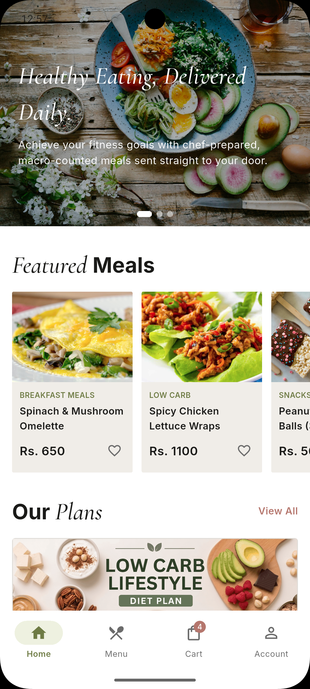
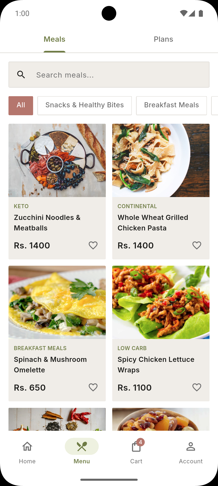
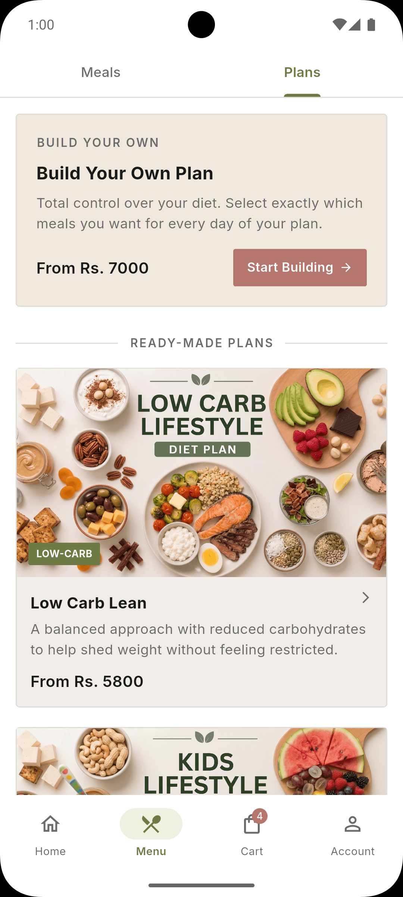
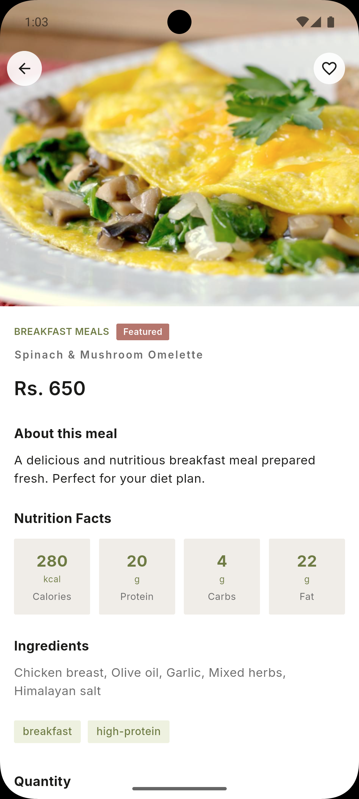
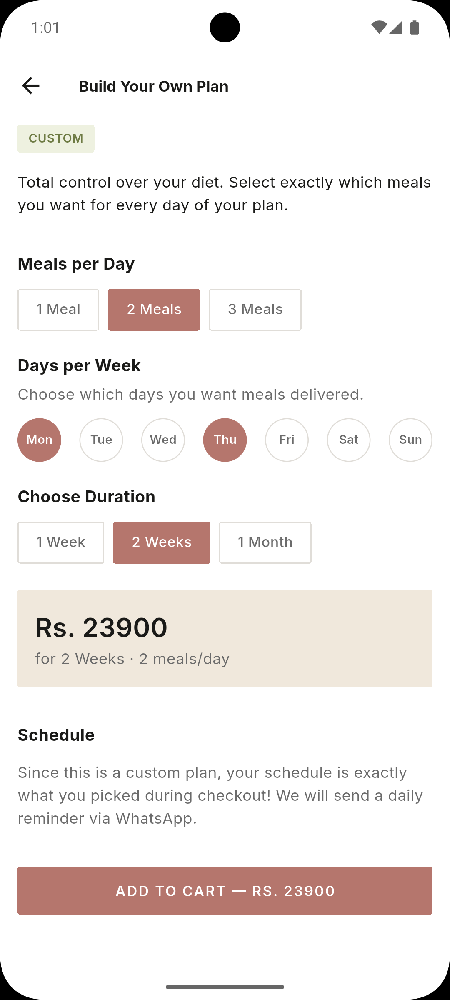
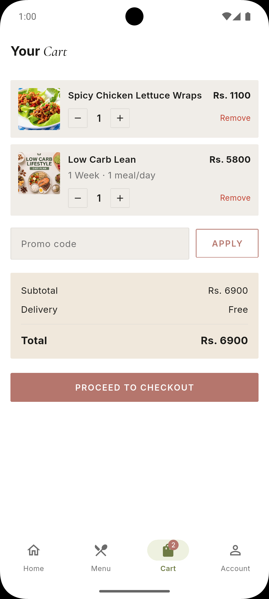
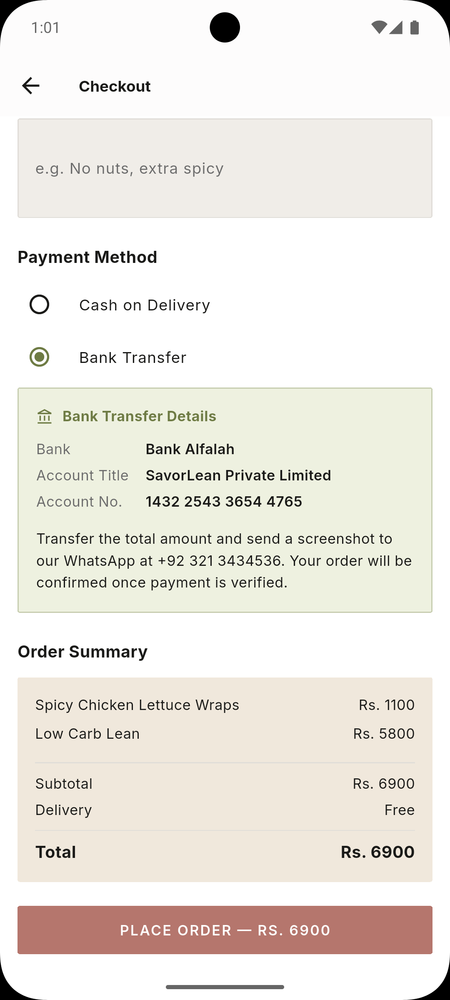

# SavorLean — Mobile App

> Fresh diet meal-plan delivery for Lahore. Order healthy, chef-prepared meals delivered to your door.

The Android companion to the SavorLean web app, built with Flutter. Both the website and the app are live and connect to the same Supabase backend.

## Live

| Platform | Link |
|---|---|
| 🌐 Website | [savorlean.netlify.app](https://savorlean.netlify.app) |
| 📱 Android App | [Download APK v1.0.0](https://github.com/ChromeUnleashed/savorlean-mobile/releases/latest/download/savorlean_release_v1.0.0.apk) |

---

## Download

<a href="https://github.com/ChromeUnleashed/savorlean-mobile/releases/latest/download/savorlean_release_v1.0.0.apk">
  
</a>

> **Android only.** After downloading, allow installation from unknown sources if prompted.

---

## Screenshots

<p>
  
  
  
  
</p>
<p>
  
  
  
</p>

---

## Features

- **Browse meals** — grid view with category filter chips and real-time search
- **Meal detail** — full nutrition facts, ingredients, tags, and quantity selector
- **Subscription plans** — browse diet plan packages with duration and pricing options
- **Cart** — add meals and plans, adjust quantities, apply promo codes
- **Checkout** — COD and bank transfer, delivery address, meal instructions, schedule preferences
- **Order history** — full order detail with status and item breakdown
- **Wishlist** — save meals with optimistic toggle, persisted to database
- **Profile** — edit name, phone, and default delivery address
- **Authentication** — email/password and Google Sign-In via Supabase Auth

---

## Tech Stack

| Concern | Technology |
|---|---|
| Framework | Flutter 3.x (Dart) |
| Backend | Supabase (Auth, PostgreSQL, Row Level Security) |
| State management | Riverpod 2 (`riverpod_annotation` + code generation) |
| Navigation | go_router (ShellRoute, deep links, auth guards) |
| Fonts | Google Fonts — Inter + Cormorant Garamond |
| Image caching | cached_network_image |
| Authentication | Supabase Auth + google_sign_in |

---

## Architecture

Strict separation between data, business logic, and UI — screens never touch Supabase directly.

```
lib/
  models/       ← Plain Dart data classes (Meal, Order, SubscriptionPlan, …)
  services/     ← All Supabase queries (MealService, OrderService, …)
  providers/    ← Riverpod providers — bridge between services and UI
  screens/      ← Full-screen widgets, one file per screen
  widgets/      ← Reusable UI components (AppButton, MealCard, …)
  theme/        ← AppColors, AppTextStyles, ThemeData
  router/       ← go_router configuration and auth redirect guard
```

---

## Running Locally

### Prerequisites

- Flutter SDK ≥ 3.x
- A Supabase project (or access to the existing one)

### 1. Clone the repo

```bash
git clone https://github.com/ChromeUnleashed/savorlean-mobile.git
cd savorlean-mobile
```

### 2. Set up environment variables

Copy the example file and fill in your Supabase credentials:

```bash
cp dart_defines.example.json dart_defines.json
```

```json
{
  "SUPABASE_URL": "https://your-project.supabase.co",
  "SUPABASE_ANON_KEY": "your-anon-key"
}
```

Find these in your Supabase dashboard → Project Settings → API.

### 3. Install dependencies

```bash
flutter pub get
```

### 4. Run

```bash
flutter run --dart-define-from-file=dart_defines.json
```

### 5. Build a release APK

```bash
flutter build apk --release --dart-define-from-file=dart_defines.json
```

> Release signing requires `android/key.properties` and a keystore — see the [Flutter docs on signing](https://docs.flutter.dev/deployment/android#signing-the-app).

